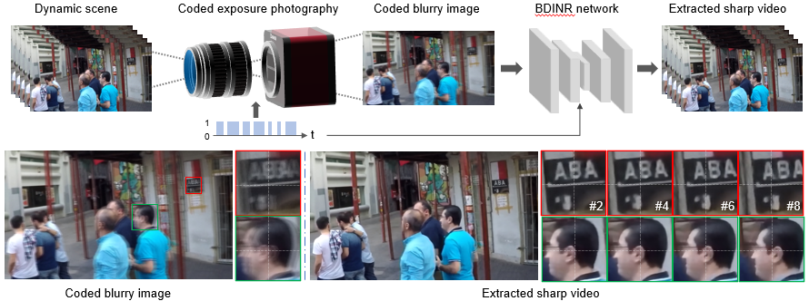

# Lightweight High-Speed Photography Built on Coded Exposure and Implicit Neural Representation of Videos

[This repository](https://github.com/zhihongz/BDINR) contains the PyTorch code for our paper "Lightweight High-Speed Photography Built on Coded Exposure and Implicit Neural Representation of Videos" by [Zhihong Zhang](https://zhihongz.github.io/), Runzhao Yang, Jinli Suo, Yuxiao Cheng, and Qionghai Dai.

> [paper](https://dx.doi.org/10.1007/s11263-024-02198-1) | [arxiv](https://arxiv.org/abs/2311.13134v2)


## 📖 Introduction



Restoring motion from blur is a challenging task due to the inherent ill-posedness of motion blur decomposition, the intrinsic ambiguity in motion direction, and the diverse motions present in natural videos. In this work, by leveraging classical coded exposure imaging technique and emerging implicit neural representation for videos, we tactfully embed the motion direction cues into the blurry image during the imaging process and develop a novel self-recursive neural network to sequentially retrieve the latent video sequence from the blurry image utilizing the embedded motion direction cues. 


## 🧰 Requirements

Please refer to [requirements.txt](./requirements.txt).

## 🚅 How to run

#### Training

change the configuration files in `conf/` and run the following command:

```bash
python train.py
```

#### Testing

change the configuration files in `conf/` and run the following command:

> Your should be able to directly run the following command with the provided pre-trained model for a quick demonstration.

```bash
python test.py
```

## 🔖 Citation

```
@article{zhang_lightweight_2024,
	title = {Lightweight {High}-{Speed} {Photography} {Built} on {Coded} {Exposure} and {Implicit} {Neural} {Representation} of {Videos}},
	issn = {1573-1405},
	url = {https://doi.org/10.1007/s11263-024-02198-1},
	doi = {10.1007/s11263-024-02198-1},
	journal = {International Journal of Computer Vision},
	author = {Zhang, Zhihong and Yang, Runzhao and Suo, Jinli and Cheng, Yuxiao and Dai, Qionghai},
	month = aug,
	year = {2024},
}
```
